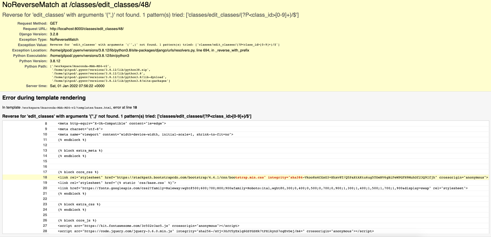
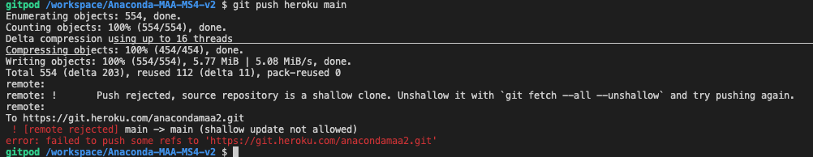
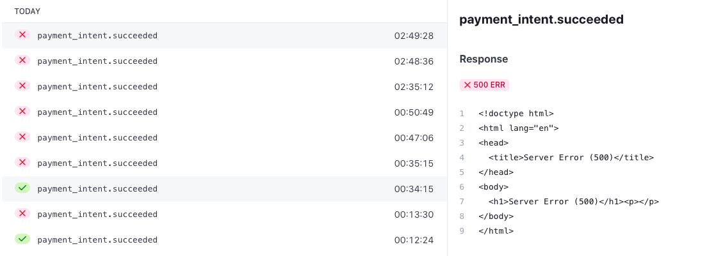
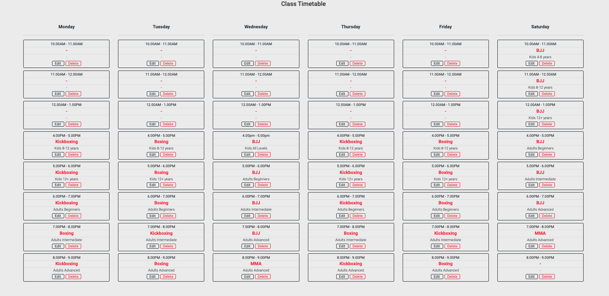
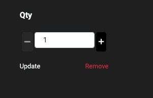
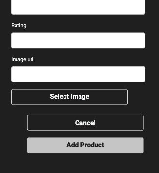
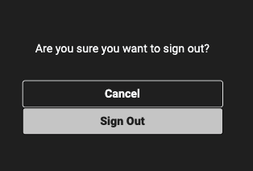

 

#### Contents
[Testing](#testing)
- [Automated Testing](#automated-testing)
- [UX Testing](#ux-testing)
- [Manual Testing](#manual-testing)
- [Bugs](#bugs)
    - [Bugs Fixed](#bugs-fixed)
    - [Bugs not Fixed](#bugs-not-fixed)

 

[Back to main README file](README.md#contents)

---
---

## Testing

 

### Automated Testing

 

- [W3C Markup Validator](https://validator.w3.org/) was used for HTML validation:

	Navbar contains the following 3 errors that I didn't have time to fix.
	
	Because they are in the navbar they will appear on every page:

	 

	Error: 1 & 2  
	<code>Element li not allowed as child of element div in this context.</code>

	Needs a bit time as just putting &lt;li&gt; inside &lt;ul&gt; was affecting the size of the navbar on mobiles.

	 

	Error: 3  
	<code>Duplicate ID</code>

	This ID works with bootstrap dropdown menu, one ID is displayed on large devices, the other one is on small devices. The workaround needs a bit more 
	thought.

	 

	- _Home page_ validator result [HERE](https://validator.w3.org/nu/?doc=https%3A%2F%2Fanacondamaa2.herokuapp.com%2F) - Errors: 3
	- _About page_ validator result [HERE](https://validator.w3.org/nu/?doc=https%3A%2F%2Fanacondamaa2.herokuapp.com%2Fclasses%2Fabout%2F) - Errors: 3
	- _Classes page_ validator result [HERE](https://validator.w3.org/nu/?doc=https%3A%2F%2Fanacondamaa2.herokuapp.com%2Fclasses%2Ftimes%2F) - Errors: 3
	- _Add Class page_ validator result [HERE](https://validator.w3.org/nu/?doc=https%3A%2F%2Fanacondamaa2.herokuapp.com%2Fclasses%2Fadd%2F) - Errors: 3
	- _Edit Class page_ validator result [HERE](https://validator.w3.org/nu/?doc=https%3A%2F%2Fanacondamaa2.herokuapp.com%2Fclasses%2Fedit%2F1%2F) - Errors: 3
	- _Shop page_ validator result [HERE](https://validator.w3.org/nu/?doc=https%3A%2F%2Fanacondamaa2.herokuapp.com%2Fproducts) - Errors: 3
	- _Product Details page_ validator result [HERE](https://validator.w3.org/nu/?doc=https%3A%2F%2Fanacondamaa2.herokuapp.com%2Fproducts%2F1%2F) - Errors: 3
	- _Add Product page_ validator result [HERE](https://validator.w3.org/nu/?doc=https%3A%2F%2Fanacondamaa2.herokuapp.com%2Fproducts%2Fadd%2F) - Errors: 3
	- _Edit Product page_ validator result [HERE](https://validator.w3.org/nu/?doc=https%3A%2F%2Fanacondamaa2.herokuapp.com%2Fproducts%2Fedit%2F1) - Errors: 3
	- _Shopping Bag page_ validator result [HERE](https://validator.w3.org/nu/?doc=https%3A%2F%2Fanacondamaa2.herokuapp.com%2Fbag%2F) - Errors: 3
	- _Checkout page_ validator result [HERE](https://validator.w3.org/nu/?doc=https%3A%2F%2Fanacondamaa2.herokuapp.com%2Fcheckout%2F) - Errors: 3
	- _Checkout Success / Order History page_ validator result [HERE](https://validator.w3.org/nu/?doc=https%3A%2F%2Fanacondamaa2.herokuapp.com%2Fprofile%2Forder_history%2FA6B9F939723E49AA97B306EB2DFE5009) - Errors: 3
	- _Contact page_ validator result [HERE](https://validator.w3.org/nu/?doc=https%3A%2F%2Fanacondamaa2.herokuapp.com%2Fcontact%2Fcontact) - Errors: 3
    - _Memberships page_ validator result [HERE](https://validator.w3.org/nu/?doc=https%3A%2F%2Fcookable.herokuapp.com%2Fcontacta) - Errors: RETEST
    - _Add Membership page_ validator result [HERE](https://validator.w3.org/nu/?doc=https%3A%2F%2Fanacondamaa2.herokuapp.com%2Fmemberships%2Fadd%2F) - Errors: 3
    - _Edit Membership page_ validator result [HERE](https://validator.w3.org/nu/?doc=https%3A%2F%2Fanacondamaa2.herokuapp.com%2Fmemberships%2Fedit%2F1%2F) - Errors: 3
    - _Profile page_ validator result [HERE](https://validator.w3.org/nu/?doc=https%3A%2F%2Fanacondamaa2.herokuapp.com%2Fprofile) - Errors: 3
    - _Logout page (allauth)_ validator result [HERE](https://validator.w3.org/nu/?doc=https%3A%2F%2Fanacondamaa2.herokuapp.com%2Faccounts%2Flogout%2F) - Errors: 3
    - _Login page (allauth)_ validator result [HERE](https://validator.w3.org/nu/?doc=https%3A%2F%2Fanacondamaa2.herokuapp.com%2Faccounts%2Flogin%2F) - Errors: 3
    - Sign Up page (allauth)_ validator result [HERE](https://validator.w3.org/nu/?doc=https%3A%2F%2Fanacondamaa2.herokuapp.com%2Faccounts%2Fsignup%2F) - Errors: 3

 

- [W3C CSS Validator](https://jigsaw.w3.org/css-validator/) was used for CSS validation:

	There seems to be 1 error same across all pages, so mut be coming from
	base.css file, I can't find where is it though:

	<code>Value Error : color fff is not a color value : fff</code>

	- _Home page_ validator result [HERE](https://jigsaw.w3.org/css-validator/validator?uri=https%3A%2F%2Fanacondamaa2.herokuapp.com%2F&profile=css3svg&usermedium=all&warning=1&vextwarning=&lang=en) - Errors: 1
	- _About page_ validator result [HERE](https://jigsaw.w3.org/css-validator/validator?uri=https%3A%2F%2Fanacondamaa2.herokuapp.com%2Fclasses%2Fabout%2F&profile=css3svg&usermedium=all&warning=1&vextwarning=&lang=en) - Errors: 1
	- _Classes page_ validator result [HERE](https://jigsaw.w3.org/css-validator/validator?uri=https%3A%2F%2Fanacondamaa2.herokuapp.com%2Fclasses%2Ftimes%2F&profile=css3svg&usermedium=all&warning=1&vextwarning=&lang=en) - Errors: 1
	- _Add Class page_ validator result [HERE](https://jigsaw.w3.org/css-validator/validator?uri=https%3A%2F%2Fanacondamaa2.herokuapp.com%2Fclasses%2Fadd%2F&profile=css3svg&usermedium=all&warning=1&vextwarning=&lang=en) - Errors: 1
	- _Edit Class page_ validator result [HERE](https://jigsaw.w3.org/css-validator/validator?uri=https%3A%2F%2Fanacondamaa2.herokuapp.com%2Fclasses%2Fedit%2F1%2F&profile=css3svg&usermedium=all&warning=1&vextwarning=&lang=en) - Errors: 1
	- _Shop page_ validator result [HERE](https://jigsaw.w3.org/css-validator/validator?uri=https%3A%2F%2Fanacondamaa2.herokuapp.com%2Fproducts%2F&profile=css3svg&usermedium=all&warning=1&vextwarning=&lang=en) - Errors: 1
	- _Product Details page_ validator result [HERE](https://jigsaw.w3.org/css-validator/validator?uri=https%3A%2F%2Fanacondamaa2.herokuapp.com%2Fproducts%2F1%2F&profile=css3svg&usermedium=all&warning=1&vextwarning=&lang=en) - Errors: 1
	- _Add Product page_ validator result [HERE](https://jigsaw.w3.org/css-validator/validator?uri=https%3A%2F%2Fanacondamaa2.herokuapp.com%2Fproducts%2Fadd%2F&profile=css3svg&usermedium=all&warning=1&vextwarning=&lang=en) - Errors: 1
	- _Edit Product page_ validator result [HERE](https://jigsaw.w3.org/css-validator/validator?uri=https%3A%2F%2Fanacondamaa2.herokuapp.com%2Fproducts%2Fedit%2F1&profile=css3svg&usermedium=all&warning=1&vextwarning=&lang=en) - Errors: 1
	- _Shopping Bag page_ validator result [HERE](https://jigsaw.w3.org/css-validator/validator?uri=https%3A%2F%2Fanacondamaa2.herokuapp.com%2Fbag%2F&profile=css3svg&usermedium=all&warning=1&vextwarning=&lang=en) - Errors: 1
	- _Checkout page_ validator result [HERE](https://jigsaw.w3.org/css-validator/validator?uri=https%3A%2F%2Fanacondamaa2.herokuapp.com%2Fcheckout%2F&profile=css3svg&usermedium=all&warning=1&vextwarning=&lang=en) - Errors: 1
	- _Checkout Success / Order History page_ validator result [HERE](https://jigsaw.w3.org/css-validator/validator?uri=https%3A%2F%2Fanacondamaa2.herokuapp.com%2Fprofile%2Forder_history%2FA6B9F939723E49AA97B306EB2DFE5009&profile=css3svg&usermedium=all&warning=1&vextwarning=&lang=en) - Errors: 1
	- _Contact page_ validator result [HERE](https://jigsaw.w3.org/css-validator/validator?uri=https%3A%2F%2Fanacondamaa2.herokuapp.com%2Fcontact%2Fcontact&profile=css3svg&usermedium=all&warning=1&vextwarning=&lang=en) - Errors: 1
    - _Memberships page_ validator result [HERE](https://jigsaw.w3.org/css-validator/validator?uri=https%3A%2F%2Fanacondamaa2.herokuapp.com%2Fmemberships%2F&profile=css3svg&usermedium=all&warning=1&vextwarning=&lang=en) - Errors: 1
    - _Add Membership page_ validator result [HERE](https://jigsaw.w3.org/css-validator/validator?uri=https%3A%2F%2Fanacondamaa2.herokuapp.com%2Fmemberships%2Fadd%2F&profile=css3svg&usermedium=all&warning=1&vextwarning=&lang=en) - Errors: 1
    - _Edit Membership page_ validator result [HERE](https://jigsaw.w3.org/css-validator/validator?uri=https%3A%2F%2Fanacondamaa2.herokuapp.com%2Fmemberships%2Fedit%2F1%2F&profile=css3svg&usermedium=all&warning=1&vextwarning=&lang=en) - Errors: 1
    - _Profile page_ validator result [HERE](https://jigsaw.w3.org/css-validator/validator?uri=https%3A%2F%2Fanacondamaa2.herokuapp.com%2Fprofile%2F&profile=css3svg&usermedium=all&warning=1&vextwarning=&lang=en) - Errors: 1
    - _Logout page (allauth)_ validator result [HERE](https://jigsaw.w3.org/css-validator/validator?uri=https%3A%2F%2Fanacondamaa2.herokuapp.com%2Faccounts%2Flogout%2F&profile=css3svg&usermedium=all&warning=1&vextwarning=&lang=en) - Errors: 1
    - _Login page (allauth)_ validator result [HERE](https://jigsaw.w3.org/css-validator/validator?uri=https%3A%2F%2Fanacondamaa2.herokuapp.com%2Faccounts%2Flogin%2F&profile=css3svg&usermedium=all&warning=1&vextwarning=&lang=en) - Errors: 1
    - Sign Up page (allauth)_ validator result [HERE](https://jigsaw.w3.org/css-validator/validator?uri=https%3A%2F%2Fanacondamaa2.herokuapp.com%2Faccounts%2Fsignup%2F&profile=css3svg&usermedium=all&warning=1&vextwarning=&lang=en) - Errors: 1

 

- [JSHint](https://jshint.com/) was used for JavaScript validation (New JavaScript features (ES6) and jQuery were selected in configuration):

	JS Files:
	- stripe_elements.js - JavaScript validation:
	
		<code>One undefined variable: Stripe</code>

		I'm going to ignore this as it comes from Stripe documentation
	
	 

	- sendEmail.js - JavaScript validation:

		<code>One undefined variable: emaijs</code>

		<code>One unused variable: sendMail</code>

		I'm going to ignore this as it comes from EmailJS documentation

	 

	- countryfield.js - JavaScript validation - No issues

	 

	- In-HTML scripts - No issues

 

- [Web Accessibility](https://www.webaccessibility.com) was used to validate website's accessibility - Avarage Score: 96.5%

	- _Home page_ web accesibility: 98%
	- _About page_ web accesibility: 98%
	- _Classes page_ web accesibility: 98%
	- _Add Class page_ web accesibility: 96%
	- _Edit Class page_ web accesibility: 96%
	- _Shop page_ web accesibility: 92%
	- _Product Details page_ web accesibility: 92%
	- _Add Product page_ web accesibility: 96%
	- _Edit Product page_ web accesibility: 96%
	- _Shopping Bag page_ web accesibility: 98%
	- _Checkout page_ web accesibility: 92%
	- _Checkout Success page_ web accesibility: 98%
	- _Contact page_ web accesibility: 98%
    - _Memberships page_ web accesibility: 96%
    - _Add Membership page_ web accesibility: 96%
    - _Edit Membership page_ web accesibility: 96%
    - _Profile page_ web accesibility: 96%
    - _Login page (allauth)_ web accesibility: 96%
    - _Logout page (allauth)_ web accesibility: 98%
    - _Sign Up page (allauth)_ web accesibility: 96%
	
 

    
- [Google Mobile Friendly Test](https://search.google.com/test/mobile-friendly) was used to test responsiveness of the website:

	- _Home page_ - test result [HERE](https://search.google.com/test/mobile-friendly/result?id=_em5yvvG8bHaONORsECTDg) - Mobile Friendly
	- _About page_ - test result [HERE](https://search.google.com/test/mobile-friendly/result?id=2en46f7_ukYc_z_b5JnKFQ) - Mobile Friendly
	- _Classes page_ - test result [HERE](https://search.google.com/test/mobile-friendly/result?id=flEszDo6hVRjCEOA4UP6lA) - Mobile Friendly
	- _Add Class page_ - test result [HERE](https://search.google.com/test/mobile-friendly/result?id=Rb9JpnyjaugrHpr2CKjXYA) - Mobile Friendly
	- _Edit Class page_ - test result [HERE](https://search.google.com/test/mobile-friendly/result?id=-rG577s2SnPHwVYvFa_9wg) - Mobile Friendly
	- _Shop page_ - test result [HERE](https://search.google.com/test/mobile-friendly/result?id=v6p7Pz90t4fpWdSE44fMog) - Mobile Friendly
	- _Product Details page_ - test result [HERE](https://search.google.com/test/mobile-friendly/result?id=5hb5glFvnUbITu3vDzJIrA) - Mobile Friendly
	- _Add Product page_ - test result [HERE](https://search.google.com/test/mobile-friendly/result?id=AjR3Wzb1uiI1VtOg6rNHAw) - Mobile Friendly
	- _Edit Product page_ - test result [HERE](https://search.google.com/test/mobile-friendly/result?id=6yuhuZ_KIZEcycnJEgx9Rw) - Mobile Friendly
	- _Shopping Bag page_ - test result [HERE](https://search.google.com/test/mobile-friendly/result?id=WONfShbLfqATD1R7nXKafw) - Mobile Friendly
	- _Checkout page_ - test result [HERE](https://search.google.com/test/mobile-friendly/result?id=BAwnBjdS5dXgYCnoGL4Ztg) - Mobile Friendly
	- _Checkout Success page_ - test result [HERE](https://search.google.com/test/mobile-friendly/result?id=jyW3nJFVP2Ebcu-qCexE9A) - Mobile Friendly
	- _Contact page_ - test result [HERE](https://search.google.com/test/mobile-friendly/result?id=Af7IxmwPyQIxN0Oz0GswYw) - Mobile Friendly
    - _Memberships page_ - test result [HERE](https://search.google.com/test/mobile-friendly/result?id=YDWHTKyWORgJn-rMA1pD3g) - Mobile Friendly
    - _Add Membership page_ - test result [HERE](https://search.google.com/test/mobile-friendly/result?id=epIH1PDhj3Rumd17dMNY4w) - Mobile Friendly
    - _Edit Membership page_ - test result [HERE](https://search.google.com/test/mobile-friendly/result?id=oiEQLCYDjhyDMz1vHUNjJQ) - Mobile Friendly
    - _Profile page_ - test result [HERE](https://search.google.com/test/mobile-friendly/result?id=LUjgsvISSCyXVbjqy7cYSw) - Mobile Friendly
    - _Login page (allauth)_ - test result [HERE](https://search.google.com/test/mobile-friendly/result?id=GPStYF30RbY_APhfk3M3jg) - Mobile Friendly
    - _Logout page (allauth)_ - test result [HERE](https://search.google.com/test/mobile-friendly/result?id=gi-pgFssyGK_6Wiu0baHPw) - Mobile Friendly
    - _Sign Up page (allauth)_ - test result [HERE](https://search.google.com/test/mobile-friendly/result?id=MkHvxg0ilBCOEH0py2A0ww) - Mobile Friendly

 
	
- [PEP8 online](http://pep8online.com/) was used to verify Python code.

	GitPod's linter was showing too many issues coming from automatically created files, like migrations etc. I decided to verify only view.py files:

	- bag (views.py) - PASSED
	- checkout (views.py) - PASSED
	- classes (views.py) - PASSED
	- contact (views.py) - PASSED
	- home (views.py) - PASSED
	- membership (views.py) - PASSED
	- products (views.py) - lines 44, 48, 94 and 122 too long (I am not sure how to break safely)
	- profiles (views.py) - line 23 too long (I am not sure how to break  safely)

 

[Back to top](#contents)

---

 

### UX Testing

- Link to User Stories Testing - [CLICK HERE](https://docs.google.com/spreadsheets/d/1CIi1zBifp5aBSsgi96vp9oLkrAsZ-a9Hyv3Tw9sNon4/edit?usp=sharing)

 

[Back to top](#contents)

---

 

### Manual Testing

#### Manual Testing Contents
- [1. Navbar Desktop](#navbar-desktop)
- [2. Navbar Mobile](#navbar-mobile)
- [3. Footer](#footer)
- [4. Home Page](#home-page)
- [5. About Page](#about-page)
- [6. Classes Page](#classes-page)
- [7. Shop Page](#shop-page)
- [8. Contact Page](#contact-page)
- [9. Membership Page](#membership-page)
- [10. Sign Up Page](#sign-up-page)
- [11. Sign In Page](#sign-in-page)
- [12. Add Product Page](#add-product-page)
- [13. Add Membership Page](#add-membership-page)
- [14. Add Class Page](#add-class-page)
- [15. My Profile Page](#my-profile-page)
- [16. Sign Out Page](#sign-out-page)
- [17. Product Details Page](#product-details-page)
- [18. Edit Product Page](#edit-product-page)
- [19. Edit Membership Page](#edit-membership-page)
- [20. Edit Class Page](#edit-class-page)
- [21. Shopping Bag Page](#shopping-bag-page)
- [22. Checkout Page](#checkout-page)
- [23. Checkout Success Page](#checkout-success-page)
- [24. Order Details Page](#order-details-page)
- [25. Toasts](#toasts)

 

1. #### Navbar Desktop

Unregistered user:

- TEST 1.1 - _Anaconda MAA_ logo links to the _Home_ page - YES
- TEST 1.2 - _About_ link goes to _About_ page - YES
- TEST 1.3 - _Classes_ link goes to _Classes_ page - YES
- TEST 1.4 - _Shop_ link goes to _Shop_ page - YES
- TEST 1.5 - _Contact_ link goes to _Contact_ page - YES
- TEST 1.6 - "Shopping bag amount in Euros" link goes to _Shopping Bag_ page - YES
- TEST 1.7 - _Join Now_ link goes to _Membership_ page - YES
- TEST 1.8 - _Account_ button submenu shows only _Login_ and _Sign up_ links to non-registered (not logged in) users - YES
- TEST 1.9 - _Sign up_ link under _Accounts_ button (not logged in user) links to _Sign Up_ page - YES
- TEST 1.10 - _Login_ link under _Accounts_ button (not logged in user) links to _Sign In_ page - YES

 

Registered user:

- TEST 1.11 - _Account_ button submenu shows only _My Profile_ and _Logout_ links to registered (and logged in) users - YES
- TEST 1.12 - User icon appears above _Account_ button when user is logged in and disappears when user logged out - YES
- TEST 1.13 - "Shopping bag amount in Euros" link stays white when _Shopping Bag_ is empty and becomes blue when there is at least one item in the _Shopping Bag_ - YES
- TEST 1.14 - "Shopping bag amount in Euros" link value always reflects the actual total value of the _Shopping Bag_ - YES
    - TEST 1.15 - _My Profile_ link under _Accounts_ button (registered user) links to _My Profile_ page - YES
    - TEST 1.16 - _Logout_ link under _Accounts_ button (registered user) links to _Sign Out_ page - YES

 

Admin user:

- TEST 1.17 - _Account_ button submenu shows _Products_, _Memberships_, _Classes_, _My Profile_ and _Logout_ links to (logged in) admin users - YES
- TEST 1.18 - _Products_ link under _Accounts_ button (admin user) links to _Add Product_ page - YES
- TEST 1.19 - _Memberships_ link under _Accounts_ button (admin user) links to _Add Membership_ page - YES
- TEST 1.20 - _Classes_ link under _Accounts_ button (admin user) links to _Add Class_ page - YES

 

[Back to Manual Testing Contents](#manual-testing-contents)

 

2. #### Navbar Mobile

Unregistered user:
- TEST 2.1 - _Anaconda MAA_ logo links to the _Home_ page - YES
- TEST 2.2 - 'Hamburger' button unfolds/folds the navigation links - YES
- TEST 2.3 - _About_ link goes to _About_ page - YES
- TEST 2.4 - _Classes_ link goes to _Classes_ page - YES
- TEST 2.5 - _Shop_ link goes to _Shop_ page - YES
- TEST 2.6 - _Contact_ link goes to _Contact_ page - YES
- TEST 2.7 - _Join Now_ link goes to _Membership_ page - YES
- TEST 2.8 - "Shopping bag amount in Euros" link goes to _Shopping Bag_ page - YES
- TEST 2.9 - _Account_ button submenu shows only _Login_ and _Sign up_ links to non-registered (not logged in) users - YES
- TEST 2.10 - _Sign up_ link under _Accounts_ button (not logged in user) links to _Sign Up_ page - YES
- TEST 2.11 - _Login_ link under _Accounts_ button (not logged in user) links to _Sign In_ page - YES

 

Registered user:

- TEST 2.12 - _Account_ button submenu shows only _My Profile_ and _Logout_ links to registered (and logged in) users - YES
- TEST 2.13 - User icon appears above _Account_ button when user is logged in and disappears when user logs out - YES
- TEST 2.14 - "Shopping bag amount in Euros" link stays white when _Shopping Bag_ is empty and becomes blue when there is at least one item in the _Shopping Bag_ - YES
- TEST 2.15 - "Shopping bag amount in Euros" link value always reflects the actual total value of the _Shopping Bag_ - YES
    - TEST 2.16 - _My Profile_ link under _Accounts_ button (registered user) links to _My Profile_ page - YES
    - TEST 2.17 - _Logout_ link under _Accounts_ button (registered user) links to _Sign Out_ page - YES

 

Admin user:

- TEST 2.18 - _Account_ button submenu shows _Products_, _Memberships_, _Classes_, _My Profile_ and _Logout_ links to (logged in) admin users - YES
- TEST 2.19 - _Products_ link under _Accounts_ button (admin user) links to _Add Product_ page - YES
- TEST 2.20 - _Memberships_ link under _Accounts_ button (admin user) links to _Add Membership_ page - YES
- TEST 2.21 - _Classes_ link under _Accounts_ button (admin user) links to _Add Class_ page - YES

 

[Back to Manual Testing Contents](#manual-testing-contents)

 

3. #### Footer:

- TEST 3.1 - _Home_ link goes to _Home_ page - YES
- TEST 3.2 - _About_ link goes to _About_ page - YES
- TEST 3.3 - _Classes_ link goes to _Classes_ page - YES
- TEST 3.4 - _Shop_ link goes to _Shop_ page - YES
- TEST 3.5 - _Contact_ link goes to _Contact_ page - YES
- TEST 3.6 - _Join Now_ link goes to _Membership_ page - YES
- TEST 3.7 - _Twitter_ icon opens _Twitter_ home page in new tab - YES
- TEST 3.8 - _Pinterest_ icon opens _Pinterest_ home page in new tab - YES
- TEST 3.9 - _Facebook_ icon opens _Facebook_ home page in new tab - YES
- TEST 3.10 - _Instagram_ icon opens _Instagram_ home page in new tab - YES
    - TEST 3.11 - _Youtube_ icon opens _Youtube_ home page in new tab - YES

 

[Back to Manual Testing Contents](#manual-testing-contents)

 

4. #### Home Page:

- TEST 4.1 - _Join Our Academy_ button on main banner links to _Membership_ page - YES
- TEST 4.2 - _Brazilian Jiu-Jitsu_ image links to _Why Brazilian Jiu-Jitsu?_ section in _About_ page - YES
- TEST 4.3 - _Read more_ link under Brazilian Jiu-Jitsu image links to _Why Brazilian Jiu-Jitsu?_ section in _About_ page - YES
- TEST 4.4 - _Kickboxing_ image links to _Why Kickboxing?_ section in _About_ page - YES
- TEST 4.5 - _Read more_ link under Kickboxing image links to _Why Kickboxing?_ section in _About_ page - YES
- TEST 4.6 - _Boxing_ image links to _Why Boxing?_ section in _About_ page - YES
- TEST 4.7 - _Read more_ link under Boxing image links to _Why Boxing?_ section in _About_ page - YES

 

[Back to Manual Testing Contents](#manual-testing-contents)

 

5. #### About Page:

- TEST 5.1 - _Join Our Academy_ button in _Why Brazilian Jiu-Jitsu?_ section links to _Membership_ page - YES
- TEST 5.2 - _About our coaches..._ button in _Why Brazilian Jiu-Jitsu?_ section links to _Meet Our Instructors_ section on the same page - YES
- TEST 5.3 - _Join Our Academy_ button in _Why Kickboxing?_ section links to _Membership_ page - YES
- TEST 5.4 - _About our coaches..._ button in _Why Kickboxing?_ section links to _Meet Our Instructors_ section on the same page - YES
- TEST 5.5 - _Join Our Academy_ button in _Why Boxing ?_ section links to _Membership_ page - YES
- TEST 5.6 - _About our coaches..._ button in _Why Boxing?_ section links to _Meet Our Instructors_ section on the same page - YES
- TEST 5.7 - _Brazilian Jiu-Jitsu_ link in _Meet Our Instructors_ section links to _Why Brazilian Jiu-Jitsu?_ section on the same page - YES
- TEST 5.8 - _About Brazilian Jiu-Jitsu?_ link in _Meet Our Instructors_ section links to _Why Brazilian Jiu-Jitsu?_ section on the same page - YES
- TEST 5.9 - _Kickboxing_ link in _Meet Our Instructors_ section links to _Why Kickboxing?_ section on the same page - YES
- TEST 5.10 - _About Kickboxing..._ link in _Meet Our Instructors_ section links to _Why Kickboxing?_ section on the same page - YES
- TEST 5.11 - _Boxing_ link in _Meet Our Instructors_ section links to _Why Boxing?_ section on the same page - YES
- TEST 5.12 - _About Boxing..._ link in _Meet Our Instructors_ section links to _Why Boxing?_ section on the same page - YES

 

[Back to Manual Testing Contents](#manual-testing-contents)

 

6. #### Classes Page:

- TEST 6.1 - _See timetable..._ link in _Kids & Teens Classes_ section links to _Class Timetable_ section on the same page - YES
- TEST 6.2 - _Join Our Academy_ button in _Kids & Teens Classes_ section links to _Membership_ page - YES
- TEST 6.3 - _See timetable..._ link in _Adults Classes_ section links to _Class Timetable_ section on the same page - YES
- TEST 6.4 - _Join Our Academy_ button in _Adults Classes_ section links to _Membership_ page - YES

 

Admin user:
- TEST 6.5 - _Edit_ and _Delete_ buttons appear in each class box in _Class Timetable_ section when admin user is logged in - YES
- TEST 6.6 - _Edit_ button in each class box in _Class Timetable_ section links to the _Edit Class_ page populated with the corresponding class details - relevant 'toast' is displayed - YES
- TEST 6.6 - _Delete_ button in each class box in _Class Timetable_ section deletes the respective class - relevant 'toast' is displayed - YES

 

[Back to Manual Testing Contents](#manual-testing-contents)

 

7. #### Shop Page:

- TEST 7.1 - _'Search our site'_ box empty entry reloads the page with all products - relevant 'toast' is displayed - YES
- TEST 7.2 - _'Search our site'_ search that does not appear in the database reloads the page with no products - relevant 'toast' is displayed - YES
- TEST 7.3 - _'Search our site'_ search that does appear in the database reloads the page with all products meeting the search criteria entered - relevant 'toast' is displayed - YES
- TEST 7.4 - _'Sort by Price (low to high)'_ reloads the page with current selection of products in the correct order - YES
- TEST 7.5 - _'Sort by Price (high to low)'_ reloads the page with current selection of products in the correct order - YES
- TEST 7.6 - _'Sort by Rating (low to high)'_ reloads the page with current selection of products in the correct order - YES
- TEST 7.7 - _'Sort by Rating (high to low)'_ reloads the page with current selection of products in the correct order - YES
- TEST 7.8 - _'Sort by Name (A-Z)'_ reloads the page with current selection of products in the correct order - YES
- TEST 7.9 - _'Sort by Name (Z-A)'_ reloads the page with current selection of products in the correct order - YES
- TEST 7.10 - _'Sort by Category (A-Z)'_ reloads the page with current selection of products in the correct order - YES
- TEST 7.11 - _'Sort by Category (Z-A)'_ reloads the page with current selection of products in the correct order - YES
- TEST 7.12 - Current count of products loaded works correctly - YES
- TEST 7.13 - Current count of products loaded _Products Home_ link reloads page with all products - YES
- TEST 7.14 - Clicking on the 'All' tab above the products displays all products - YES
- TEST 7.15 - Clicking on the _'Boxing Bags'_ tab above the products displays all products in the 'Boxing Bags' category - YES
- TEST 7.16 - Clicking on the _'Protective'_ tab above the products displays all products in the 'Protective' category - YES
- TEST 7.17 - Each product image links to the respective _Product Detail_ page - YES
- TEST 7.18 - _Join Our Academy_ button at the bottom of the page links to _Membership_ page - YES

 

Admin user:
- TEST 7.16 - _Edit_ and _Delete_ buttons appear underneath each product when admin user is logged in - YES
- TEST 7.17 - _Edit_ button underneath each product links to the _Edit Product_ page populated with the corresponding product details - relevant 'toast' is displayed - YES
- TEST 7.18 - _Delete_ button underneath each product deletes the respective product - relevant 'toast' is displayed - YES

 

[Back to Manual Testing Contents](#manual-testing-contents)

 

8. #### Contact Page:

- TEST 8.1 - _Contact Form_ does not validate on 'Submit' if _'Name'_ field is empty - YES
- TEST 8.2 - _Contact Form_ does not validate on 'Submit' if _'E-mail'_ field is empty - YES
- TEST 8.3 - _Contact Form_ does not validate on 'Submit' if _'E-mail'_ entry does not follow the email format (@ missing) - YES
- TEST 8.4 - _Contact Form_ does not validate on 'Submit' if _'Message'_ field is empty - YES
- TEST 8.5 - _Contact Form_ is sent successfully if form valid - relevant 'toast' is displayed - YES
- TEST 8.6 - Message from _Contact Form_ is sent to default email - EmailJS connected correctly - YES

 

[Back to Manual Testing Contents](#manual-testing-contents)

 

9. #### Membership Page

- TEST 9.1 - _Get Started_ button links to _Contact Page_ - YES
- TEST 9.2 - _See Timetables here_ link goes to _Class Timetable_ of _Classes Page_ - YES

 

Admin user:
- TEST 9.3 - _Edit_ and _Delete_ buttons appear underneath each membership box when admin user is logged in - YES
- TEST 9.5 - _Edit_ button underneath each membership links to the _Edit Membership_ page populated with the corresponding membership details - relevant 'toast' is displayed - YES
- TEST 9.6 - _Delete_ button underneath each membership box deletes the respective membership - relevant 'toast' is displayed - YES

 

[Back to Manual Testing Contents](#manual-testing-contents)

 

10. #### Sign Up Page

- TEST 10.1 - _Already have an account?_ link goes to _Sign In_ page - YES
- TEST 10.2 - _Sign Up Form_ does not validate on 'Submit' ('Sign Up') if any of the fields is empty - YES
- TEST 10.3 - _Sign Up Form_ does not validate on 'Submit' ('Sign Up') if _'E-mail address'_ entry does not follow the email format (@ missing) - YES
- TEST 10.4 - _Sign Up Form_ does not validate on 'Submit' ('Sign Up') if _'E-mail address'_ and 'E-mail address confirmation' entries are not the same - YES
- TEST 10.5 - _Sign Up Form_ does not validate on 'Submit' ('Sign Up') if _'Password'_ entry is too common (ex.password) or too short - YES
- TEST 10.6 - _Sign Up Form_ does not validate on 'Submit' ('Sign Up') if _'Password'_ and 'Password (again)' entries are not the same - YES
- TEST 10.7 - _Sign Up Form_ does not validate on 'Submit' ('Sign Up') if user with the same email address is already registered - YES
- TEST 10.8 - _Sign Up Form_ does not validate on 'Submit' ('Sign Up') if user with the same username is already registered - YES
- TEST 10.9 - On 'Submit' ('Sign Up') of the validated _Sign Up Form_ the user is redirected to the _Verify Your E-mail Address_ page - relevant 'toast' is displayed - YES
- TEST 10.10 - On 'Submit' ('Sign Up') of the validated _Sign Up Form_ the link to verify e-mail is sent to the submited e-mail address - YES
- TEST 10.11 - Verify email address link sent to email works correctly and redirects user to _Confirm E-mail Address_ page - YES
- TEST 10.12 - Confirming email address on _Confirm E-mail Address_ page takes user to _Sig In_ page - YES
- TEST 10.13 - Confirming email address on _Confirm E-mail Address_ page creates a new user in the database - YES
- TEST 10.14 - _Back to Login_ button links to _Sign In_ page - YES

 

[Back to Manual Testing Contents](#manual-testing-contents)

 

11. #### Sign In Page

- TEST 11.1 - _If you don't have account yet..._ link goes to _Sign Up_ page - YES
- TEST 11.2 - _Sign In Form_ displays Allauth message: 'The username and/or password you specified are not correct.' on 'Submit' ('Sign In'), if either _'Username'_ or _'Password'_ field entries don't match any user saved in the database - YES
- TEST 11.3 - On 'Submit' ('Sign In') of the validated and correct _Sign In Form_ the user is saved in the session cookie and redirected to the _Home_ page - YES
- TEST 11.4 - _Home_ button links to _Home_ page - YES
- TEST 11.5 - _Forgot Password_ link goes to _Password Reset_ page - YES

 

[Back to Manual Testing Contents](#manual-testing-contents)

 

12. #### Add Product Page

Admin user:

- TEST 12.1 - _Add Product Form_ does not validate on 'Submit' ('Add Product') if _'Name'_ field is empty - YES
- TEST 12.2 - _Add Product Form_ does not validate on 'Submit' ('Add Product') if _'Description'_ field is empty - YES
- TEST 12.3 - _Add Product Form_ does not validate on 'Submit' ('Add Product') if _'Price'_ field is empty - YES
- TEST 12.4 - _Add Product Form_ does not validate on 'Submit' ('Add Product') if _'Price'_ field entry has different format than digits, max digits: 6, max decimal places: 2 - YES
- TEST 12.5 - _Select Image_ button allows user to select an image (from own device) and attach it to the product - YES
- TEST 12.6 - On 'Submit' ('Add Product') of the _Add Product Form_ without image attached to the product, a default placeholder image ('no image') is attached - YES
- TEST 12.7 - 'Cancel' button links to the _Shop_ page - YES
- TEST 12.8 - On 'Submit' ('Add Product')of the validated _Add Product Form_ a new product is added to the database - YES
- TEST 12.9 - On 'Submit' ('Add Product') of the validated _Add Product Form_, the user is redirected to the _Product Details_ page of the newly added product with all information displayed correctly - relevant 'toast' is displayed - YES

 

[Back to Manual Testing Contents](#manual-testing-contents)

 

13. #### Add Membership Page

Admin user:

- TEST 13.1 - _Add Membership Form_ does not validate on 'Submit' ('Add Membership') if _'Name'_ field is empty - YES
- TEST 13.2 - _Add Membership Form_ does not validate on 'Submit' ('Add Membership') if _'Price'_ field is empty - YES
- TEST 13.3 - _Add Membership Form_ does not validate on 'Submit' ('Add Membership') if _'Price'_ field entry has different format than digits, max digits: 3 - YES
- TEST 13.4 - 'Cancel' button links to the _Membership_ page - YES
- TEST 13.5 - On 'Submit' ('Add Membership') of the validated _Add Membership Form_ a new membership is added to the database - YES
- TEST 13.6 - On 'Submit' ('Add Membership') of the validated _Add Membership Form_, the user is redirected to the _Membership_ page with the new membership rendered on the page - relevant 'toast' is displayed - YES

 

[Back to Manual Testing Contents](#manual-testing-contents)

 

14. #### Add Class Page

Admin user:

- TEST 14.1 - _Add Class Form_ does not validate on 'Submit' ('Add Class') if _'Class Name'_ field is empty - YES
- TEST 14.2 - _Add Class Form_ does not validate on 'Submit' ('Add Class') if _'Class Time'_ field is empty - YES
- TEST 14.3 - 'Cancel' button links to the _Classes_ page - YES
- TEST 14.4 - On 'Submit' ('Add Class') of the validated _Add Class Form_ a new Class is added to the database - YES
- TEST 14.5 - On 'Submit' ('Add Class') of the validated _Add Class Form_, the user is redirected to the _Classes_ page with the new class rendered on the page (if the total of all classes in database is equal to or less than 48) - relevant 'toast' is displayed - YES

 

[Back to Manual Testing Contents](#manual-testing-contents)

 

15. #### My Profile Page

- TEST 15.1 - _Order History_ section lists all orders in the database for current user - YES
- TEST 15.2 - _'Order Number'_ link in _Order History_ section, takes user to the respective order's _'Order Details'_, which is a _Thank You_ page originaly generated for the order - YES
- TEST 15.3 - On "Submit' ('Update Information') of the _Delivery Information Form_, updated _User Profile_ is saved in database - YES
- TEST 15.4 - On "Submit' ('Update Information') of the _Delivery Information Form_, the page refreshes, the form displays updated information - relevant 'toast' is displayed - YES

 

[Back to Manual Testing Contents](#manual-testing-contents)

 

16. #### Sign Out Page

- TEST 16.1 - _Sign Out_ removes user from the session button and redirects to _Home_ page - relevant 'toast' is displayed - YES
- TEST 16.2 - _Cancel_ button links to _Home_ page - YES

 

[Back to Manual Testing Contents](#manual-testing-contents)

 

17. #### Product Details Page

- TEST 17.1 - _Quantity Adjustment Bar's_ "-" button does not allow values lower than "1" - YES
- TEST 17.2 - _Quantity Adjustment Bar's_ "+" button does not allow values higher than "99" - YES
- TEST 17.3 - On "Submit" ("Add to Bag") _Quantity Adjustment Bar_ does not validate manually inserted values below "1" and above "99" - YES
- TEST 17.4 - _Keep Shopping_ button links to _Shop_ page - YES
- TEST 17.5 - _Add to Bag_ button adds current product at it's quantity set in _Quantity Adjustment Bar_ to the _Shopping Bag_, the page refreshes - relevant 'toast' is displayed - YES
- TEST 17.6 - The total value of the _Shopping Bag_ displayed in the Navbar is automatically updated upon adding product(s) to the bag (_Add to Bag_ button) - YES

 

Admin user:
- TEST 17.6 - _Edit_ and _Delete_ buttons appear underneath the product description when admin user is logged in - YES
- TEST 17.7 - _Edit_ button underneath the product description links to the _Edit Product_ page populated with the corresponding product details - YES
- TEST 17.8 - _Delete_ button underneath the product description deletes the respective product - relevant 'toast' is displayed - YES

 

[Back to Manual Testing Contents](#manual-testing-contents)

 

18. #### Edit Product Page

Admin user:

- TEST 18.1 - _Edit Product Form_ is populated with the correct information - YES
- TEST 18.2 - _Edit Product Form_ does not validate on 'Submit' ('Update Product') if _'Name'_ field is empty - YES
- TEST 18.3 - _Edit Product Form_ does not validate on 'Submit' ('Update Product') if _'Description'_ field is empty - YES
- TEST 18.4 - _Edit Product Form_ does not validate on 'Submit' ('Update Product') if _'Price'_ field is empty - YES
- TEST 18.5 - _Edit Product Form_ does not validate on 'Submit' ('Update Product') if _'Price'_ field entry has different format than digits, max digits: 6, max decimal places: 2 - YES
- TEST 18.6 - _Select Image_ button allows user to select an image (from own device) and attach it to the product/replace current image - YES
- TEST 18.8 - _Remove_ checkbox selected removes image from the product on 'Submit' ('Update Product') - YES
- TEST 18.9 - On 'Submit' ('Update Product') of the _Edit Product Form_ without image attached to the product, a default placeholder image ('no image') is attached - YES
- TEST 18.10 - 'Cancel' button links to the _Shop_ page - YES
- TEST 18.11 - On 'Submit' ('Update Product') of the validated _Edit Product Form_ the product information is updated in the database - YES
- TEST 18.12 - On 'Submit' ('Update Product') of the validated _Edit Product Form_, the user is redirected to the _Product Details_ page of the just updated product with all information displayed correctly - relevant 'toast' is displayed - YES

 

[Back to Manual Testing Contents](#manual-testing-contents)

 

19. #### Edit Membership Page

Admin user:

- TEST 19.1 - _Edit Membership Form_ is populated with the correct information - YES
- TEST 19.2 - _Edit Membership Form_ does not validate on 'Submit' ('Update Membership') if _'Name'_ field is empty - YES
- TEST 19.3 - _Edit Membership Form_ does not validate on 'Submit' ('Update Membership') if _'Price'_ field is empty - YES
- TEST 19.4 - _Edit Membership Form_ does not validate on 'Submit' ('Update Membership') if _'Price'_ field entry has different format than digits, max digits: 3 - YES
- TEST 19.4 - 'Cancel' button links to the _Membership_ page - YES
- TEST 19.5 - On 'Submit' ('Update Membership') of the validated _Add Membership Form_ the membership is updated in the database - YES
- TEST 19.6 - On 'Submit' ('Update Membership') of the validated _Add Membership Form_, the user is redirected to the _Membership_ page with just updated membership displaying correct information - relevant 'toast' is displayed - YES

 

[Back to Manual Testing Contents](#manual-testing-contents)

 

20. #### Edit Class Page

Admin user:

- TEST 20.1 - _Edit Class Form_ is populated with the correct information - YES
- TEST 20.2 - _Edit Class Form_ does not validate on 'Submit' ('Update Class') if _'Class Name'_ field is empty - YES
- TEST 20.3 - _Edit Class Form_ does not validate on 'Submit' ('Update Class') if _'Class Time'_ field is empty - YES
- TEST 20.4 - 'Cancel' button links to the _Classes_ page - YES
- TEST 20.5 - On 'Submit' ('Update Class') of the validated _Edit Class Form_ the Class is updated in the database - YES
- TEST 20.6 - On 'Submit' ('Update Class') of the validated _Edit Class Form_, the user is redirected to the _Classes_ page with just updated class displaying correct information - relevant 'toast' is displayed - YES

 

[Back to Manual Testing Contents](#manual-testing-contents)

 

21. #### Shopping Bag Page

- TEST 21.1 - The empty _Shopping Bag_ page "-" displays "Your bag is currently empty." message - YES
- TEST 21.2 - _Quantity Adjustment Bar's_ "-" button does not allow values lower than "1" - YES
- TEST 21.3 - _Quantity Adjustment Bar's_ "+" button does not allow values higher than "99" - YES
- TEST 21.4 FAILED - _Update_ button underneath each product does not validate manually inserted values in _Quantity Adjustment Bar_ below "1" and above "99" - NO
- TEST 21.4 - _Update_ button underneath each product updates corresponding product in the _Shopping Bag_ with the quantity in the _Quantity Adjustment Bar_ relevant 'toast' is displayed - YES
- TEST 21.5 - _Remove_ button underneath each product deletes corresponding product from the _Shopping Bag_ - YES
- TEST 21.6 - _Grand Total_ calculated correctly, includes delivery charges where applicable - YES
- TEST 21.7 - _Keep Shopping_ button links to _Shop_ page - YES
- TEST 21.8 - "You could get free delivery by spending just ... more" - message displayed below the _Grand Total_ for orders under EUR 50 - YES
- TEST 21.9 - _Secure Checkout_ button links to _Checkout_ page - YES
- TEST 21.10 - _Secure Checkout_ button brings full _Shopping Bag_ to _Checkout_ page - YES
- TEST 21.11 - Signing out resets the _Shopping bag_ - YES

 

[Back to Manual Testing Contents](#manual-testing-contents)

 

22. #### Checkout Page

Unregistered user:

- TEST 22.1 - _Order Summary_ shows correct contents of the _Shopping Bag_ - YES
- TEST 22.2 - _Order Form_ is empty - YES
- TEST 22.3 - _Create an accout_ and _Login_ links visible - YES
- TEST 22.4 - _Create an accout_ link goes to _Sign Up_ page - YES
- TEST 22.5 - _Login_ link goes to _Sign In_ page - YES
- TEST 22.6 - _Order Form_ does not validate on 'Submit' ('Complete Order') if _'Full Name'_ field is empty - YES
- TEST 22.7 - _Order Form_ does not validate on 'Submit' ('Complete Order') if _'Email Address'_ field is empty - YES
- TEST 22.8 - _Order Form_ does not validate on 'Submit' ('Complete Order') if _'Email Address'_ entry is not in email format (@ not included) - YES
- TEST 22.9 - _Order Form_ does not validate on 'Submit' ('Complete Order') if _'Phone Number'_ field is empty - YES
- TEST 22.10 - _Order Form_ does not validate on 'Submit' ('Complete Order') if _'Street Address 1'_ field is empty - YES
- TEST 22.11 - _Order Form_ does not validate on 'Submit' ('Complete Order') if _'Town or City'_ field is empty - YES
- TEST 22.12 - _Order Form_ does not validate on 'Submit' ('Complete Order') if _'Country'_ is not chosen - YES
- TEST 22.13 - On 'Submit' ('Complete Order') of the validated _Order Form_ the new order is created in database - YES
- TEST 22.14 - On 'Submit' ('Complete Order') of the validated _Order Form_ a new payment is created and succeeds in Stripe - YES
- TEST 22.15 - On 'Submit' ('Complete Order') of the validated _Order Form_ a payment_intent.succeeded webhook is created in Stripe - YES
- TEST 22.16 - On 'Submit' ('Complete Order') of the validated _Order Form_ user is redirected to _Checkout Success_ (_Thank You_) page - relevant 'toast' is displayed - YES
- TEST 22.17 - On 'Submit' ('Complete Order') of the validated _Order Form_ order confirmation email is sent to the user - YES
- TEST 22.18 - _Adjust Bag_ button links to _Shopping Bag_ page - YES
- TEST 22.19 - On page closed before the order has finished processing, the new order is created in database - YES
- TEST 22.20 - On page closed before the order has finished processing, a new payment is created and succeeds in Stripe - YES
- TEST 22.21 - On page closed before the order has finished processing, order confirmation email is sent to the user - YES

 

Registered user:

- TEST 22.22- _Order Summary_ shows correct contents of the _Shopping Bag_ - YES
- TEST 22.23 - _Order Form_ is populated with information from user profile in database - YES
- TEST 22.24 - _"Save this delivery info to profile"_ checkbox visible - YES
- TEST 22.25 - Completing Order with _"Save this delivery info to profile"_ checkbox checked will update user profile info with info from _Order Form_ - YES
- TEST 22.26 - Completing Order with _"Save this delivery info to profile"_ checkbox unchecked will not update user profile info - YES
- TEST 22.27 - _Order Form_ does not validate on 'Submit' ('Complete Order') if _'Full Name'_ field is empty - YES
- TEST 22.28 - _Order Form_ does not validate on 'Submit' ('Complete Order') if _'Email Address'_ field is empty - YES
- TEST 22.29 - _Order Form_ does not validate on 'Submit' ('Complete Order') if _'Email Address'_ entry is not in email format (@ not included) - YES
- TEST 22.30 - _Order Form_ does not validate on 'Submit' ('Complete Order') if _'Phone Number'_ field is empty - YES
- TEST 22.31 - _Order Form_ does not validate on 'Submit' ('Complete Order') if _'Street Address 1'_ field is empty - YES
- TEST 22.32 - _Order Form_ does not validate on 'Submit' ('Complete Order') if _'Town or City'_ field is empty - YES
- TEST 22.33 - _Order Form_ does not validate on 'Submit' ('Complete Order') if _'Country'_ is not chosen - YES
- TEST 22.34 - On 'Submit' ('Complete Order') of the validated _Order Form_ the new order is created in database - YES
- TEST 22.35 - On 'Submit' ('Complete Order') of the validated _Order Form_ a new payment is created and succeeds in Stripe - YES
- TEST 22.36 FAILED - On 'Submit' ('Complete Order') of the validated _Order Form_ a payment_intent.succeeded webhook is created in Stripe - NO
- TEST 22.37 - On 'Submit' ('Complete Order') of the validated _Order Form_ user is redirected to _Checkout Success_ (_Thank You_) page - relevant 'toast' is displayed - YES
- TEST 22.38 FAILED - On 'Submit' ('Complete Order') of the validated _Order Form_ order confirmation email is sent to the user - YES
- TEST 22.39 - _Adjust Bag_ button links to _Shopping Bag_ page - YES
- TEST 22.40 FAILED - On page closed before the order has finished processing, the new order is created in database - NO (the value of the order is EUR0 in database)
- TEST 22.41 - On page closed before the order has finished processing, a new payment is created and succeeds in Stripe - YES
- TEST 22.42 - On page closed before the order has finished processing, order confirmation email is sent to the user - YES (the value of the order is EUR0)

---

__NOTE:__

__Payment tested using below card details:__

Card number: 4242 4242 4242 4242

Expiry date: any

CVC: any

---

 

[Back to Manual Testing Contents](#manual-testing-contents)

 

23. #### Checkout Success Page
- TEST 23.1 - _Order Summary_ populated with correct order information - YES
- TEST 23.2 - _Back to Shop_ button links to _Shop_ page - YES

 

[Back to Manual Testing Contents](#manual-testing-contents)

 

24. #### Order Details Page
- TEST 24.1 - _Order Summary_ populated with correct order information - YES
- TEST 24.2 - _Back to Profile_ button links to _My Profile_ page - YES

 

[Back to Manual Testing Contents](#manual-testing-contents)

 

25. #### Toasts
- TEST 25.1 - _Sign up_ alert 'toast' - "Confirmation email sent to..." - YES
- TEST 25.2 - _Sign up_ success 'toast' - "You have confirmed..." - YES
- TEST 25.3 - _Sign in_ success 'toast' - YES
- TEST 25.4 - _Sign out_ success 'toast' - YES
- TEST 25.5 - _Add product_ success 'toast' - YES
- TEST 25.6 - _Edit product_ alert 'toast' - "You are editing..." - YES
- TEST 25.7 - _Edit product_ success 'toast' - "...updated successfully" - YES
- TEST 25.8 - _Delete product_ success 'toast' - YES
- TEST 25.9 - _Add membership_ success 'toast' - YES
- TEST 25.10 - _Edit membership_ alert 'toast' - "You are editing..." - YES
- TEST 25.11 - _Edit membership_ success 'toast' - "...updated successfully" - YES
- TEST 25.12 - _Delete membership_ success 'toast' - YES
- TEST 25.9 - _Add class_ success 'toast' - YES
- TEST 25.10 - _Edit class_ alert 'toast' - "You are editing..." - YES
- TEST 25.11 - _Edit class_ success 'toast' - "...updated successfully" - YES
- TEST 25.12 - _Delete class_ success 'toast' - YES
- TEST 25.13 - _My Profile_ updated success 'toast' - YES
- TEST 25.14 - _Order Details_ alert 'toast' "This is a past order confirmation..." - YES
- TEST 25.15 - _Shop search box_ error 'toast' "No search criteria entered" - YES
- TEST 25.16 - _Shop search box_ error 'toast' "No products found for search criteria entered" - YES
- TEST 25.17 - _Add to Bag_ product success 'toast' - YES
- TEST 25.18 - _Add to Bag_ product success 'toast' multiple products displayed in vertical scroll box - YES
- TEST 25.19 - _Add to Bag_ product success 'toast' - "Go to secure checkout" button links to _Shopping Bag_ page - YES
- TEST 25.20 - _Add to Bag_ product success 'toast' - shows "Spend ... more for free delivery" message if bag value smaller than EUR 50 - YES
- TEST 25.21 - _Add to Bag_ product success 'toast' - shows correct _Shopping Bag_ content details - YES
- TEST 25.22 - Updating product quantity on _Shopping Bag_ page success 'toast' - YES
- TEST 25.23 - _Complete Order_ success 'toast' - "Order successfully processed..." - YES
- TEST 25.24 - _Add product_ by non admin user via manually entering URL - error 'toast' - YES
- TEST 25.25 - _Edit product_ by non admin user via manually entering URL - error 'toast' - YES
- TEST 25.26 - _Delete product_ by non admin user via manually entering URL - error 'toast' - YES
- TEST 25.24 - _Add membership_ by non admin user via manually entering URL - error 'toast' - YES
- TEST 25.25 - _Edit membership_ by non admin user via manually entering URL - error 'toast' - YES
- TEST 25.26 - _Delete membership_ by non admin user via manually entering URL - error 'toast' - YES
 TEST 25.27 - _Add class_ by non admin user via manually entering URL - error 'toast' - YES
- TEST 25.28 - _Edit class_ by non admin user via manually entering URL - error 'toast' - YES
- TEST 25.29 - _Delete class_ by non admin user via manually entering URL - error 'toast' - YES
- TEST 25.30 - _Contact Form_ JS executed success 'toast' - "Message sent successfully"  - YES
- TEST 25.31 - "X" button closes toast - YES

 

[Back to Manual Testing Contents](#manual-testing-contents)

 

[Back to top](#contents)

---

 

### Bugs

 

This project was actually plagued with issues and it's difficult to document every sigle problem I had over the months I was working on it.

Here are some of the problems that took me some time to work out:

 

#### Bugs Fixed

 

1. Webhook Errors:

- Webhook Error 401:
	
	I couldn't get rid of this error for a while, I looked through my code for typos and checked if my webhook key is being set correctly.

	I found somebody having similar problem on Slack and had this suggestion that I haven't seen anywhere else: "Set Gitpod space to 'Share'". It worked for this error.

		Solution:
		
		Set Gitpod space to 'Share'.

 

- Webhook Error 302:
	
	After a while I satrted getting this new error, that I couldn't figure out the reason for, especially that webhooks were working before, I read on internet (sorry, didn't save the source) that Gitpod changed URLs for workspaces overnight.

		Solution:
		
		Update URL for webhook to listen for in Stripe to the new Gitpod work space URL.

 

2. Reverse for 'edit_class' with arguments '(",)' not found:

	I couldn't get this view to render template wit _Edit Class form_.
	I spent 2 days looking through my code and trying to compare it to 'edit_product' and 'edit_membership' views that were working fine, I couldn't find the mistake.
	
	

	I got in touch with tutors and one of them helped me to identify issue. In the context of my 'edit_class' view I was passing variable 'singleclass' representing the class clicked on (pk=class_id):

	<code>context = { 'form': form, 'singleclass': singleclass,}</code>

	But the url in my template was looking to render edit_class.html template passing the 'class.id' instead of 'singleclass.id': 

	<code>action=""</code>

		Solution:
		
		Change argument passed in the url address to the same name as the one passed in the context of the view. In this case it should have been:

		action=""

	The reason, why this simple error took me so much time was my fundamental misunderstanding of what gets passed where between views, urls and templates. With the tutor's help I've learnt something more about Django.

 

3. Push to Heroku rejected, source repository is a shallow clone.

This issue nearly gave me a heart attack :) as I'm not that proficient in git, I was expecting this to be a complete disaster when I saw it. 

 

 

As my first incomplete submission of MS4 was being graded, I knew I needed to keep on working on it, so I made the clone of the repository to continue work. When the time came to push that clone to Heroku, I saw this error: "Push rejected, source repository is a shallow clone".

I have unshallowed it as per instructions in the console, and pushed it again:

<code>$ git fetch --all --unshallow</code>

<code>$ git push heroku main</code>

After some additional build up in the console, it didn't work, I've spent some time in Google looking for more clues, and I did after that:

<code>$ git fetch --unshallow</code>

This mirraculously worked, I can't claim that I fully understand how and why, but it worked.

	Solution:
		
	$ git fetch --all --unshallow
	$ git push heroku main
	$ git fetch --unshallow
	$ git push heroku main

 
 

#### Bugs not Fixed

 

1. Webhook Error 500:

Currently the webhook for payment_intent.succeeded gives response: 200 to not signed in users and signed in users get response: 500.

I couldn't figure where the issue is, I feel that I would need a lot more time for testing to get to the bottom of that problem.

The order is created successfully and payment is still created and charged successfully for both signed in and not signed in users.

 

2. Email confirmation not sent.

After processing the order and payment, email confirmation is not sent to signed in users. Not signed in users ironically receive email confirmation.

This perhaps is somehow connected to the fact that webhook for successful payment for signed in users also doesn't work but I would need more time to investigate or get help investigating this problem.

 

3. Class Timetable is awkward.

Class Timetable is awkward to work with for deleting and adding classes.

Because I needed the classes to display in 6 columns, from Monday to Saturday, I divided the query for all classes in database into 6 lists with 8 elements in each list. Monday column displays first 8 elemnts, Tuesday column displays next 8 elements, and so on. There is only 48 elements diplaying.

Deleting last class in Monday column would shift the first Tuesday class into that position, it would take then editing all classes from Tuesday to Saturday to get the desired order back. Also 49th class can be added, but it will never be dislayed. This way the schedule is best to be amended by editing classes, rather than deleting and adding.

 

4. Various CSS issues.

There are some misalignments in element styling that could and should be fixed with more time.

 

"-" and "+" buttons in _Shopping Bag_ change height when one of them is deactivated:

 

Elements not perfectly aligned, which is especially visible on smaller screens.

Margin issues that need some more eleborate rework in order to make sense on both, small and large devices.

 

5. The hover effect on instructor's images in Safari browser is glitchy.

The hover effect (subtle zoom-in) on images of instructors in _Classes_ page is slightly broken in Safari web browser, which must be due to some default browser styles.

 

[Back to top](#contents)

---
---

 

[Back to main README file](README.md#contents)